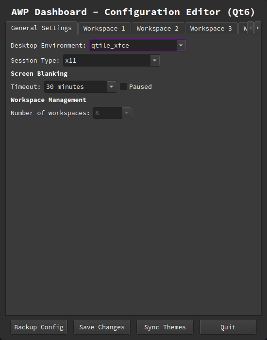
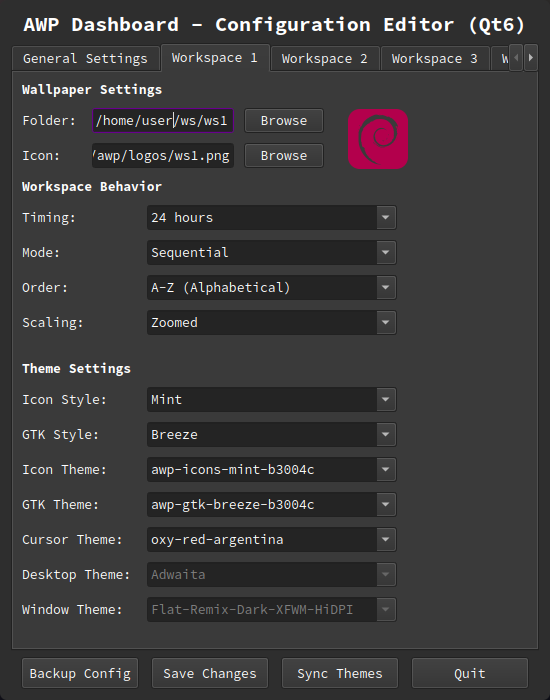
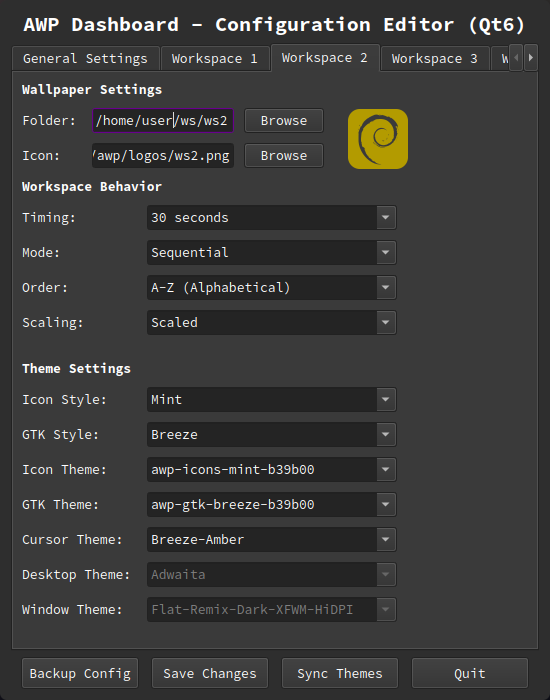
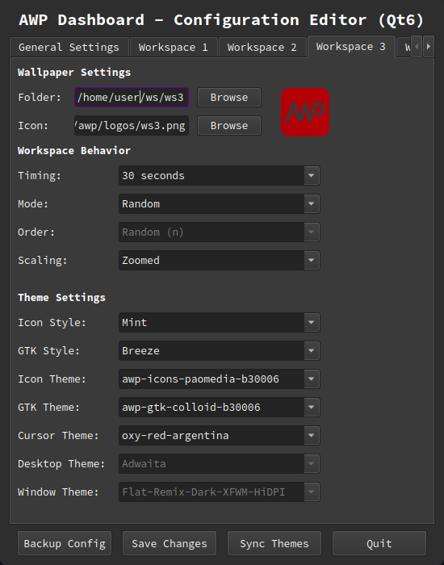

# AWP - Desktop Alchemy 🧪✨

[](https://python.org)
[](https://qt.io)
[](https://github.com/wedel-tech-art/awp-automated-wallpaper)
[](LICENSE)

## 🎯 What is Desktop Alchemy?

Most wallpaper managers rotate images.
AWP **transmutes** your entire desktop environment.

Each workspace becomes a distinct visual identity — with its own themes, icons, cursors, and wallpapers — all synchronized through a unified, intelligent architecture. From a single color, AWP **bakes** complete GTK and icon themes, creating harmony across your entire system.

## 🚀 Key Features

## ⚡ Low-Latency State Bridge & Logic (V3.7)

- **RAM-Backed Sync:** The system now utilizes `/dev/shm/qtile_current_ws` as a high-speed "Single Source of Truth," allowing the Window Manager to push workspace states directly to AWP.

- **Zero-Lag Transmutation:** By reading state from RAM, theme and wallpaper updates are triggered instantaneously upon workspace transition, eliminating polling delays and reducing CPU overhead.

- 🆕 **"Park" Action:** A new 7th navigation command in `nav.py` allows manual wallpaper application based on the current index without cycling through the library.

- 🔌 **Daemon-Less Mode:** Upgraded `awp_start.sh` with a conditional toggle to skip starting the background daemon, optimized for self-theming environments like Qtile.

- **Backend-Driven Logic:** Core actions are now delegated to specific backends (like `qtile_xfce.py`), ensuring perfect synchronization between the WM and the AWP dashboard.

- **Unified Qt6/GTK Aesthetics:** All backends now synchronize Qt6 accent colors in real-time via `/dev/shm` symlinks. This ensures Qt6 applications match your workspace’s GTK "signature" with zero disk writes.

* **🖨️ Unified Printer System (V3.6)**:
    * **Single Source of Truth**: All terminal output now flows through `core/printer.py` – no more scattered color codes.
    * **Context-Aware Prefixes**: Every module identifies itself clearly:
        - `[AWP-backends]` (🟡 Yellow) - Backend loader
        - `[AWP-daemon]` (🔵 Cyan) - Main daemon
        - `[AWP-xfce]`, `[AWP-qtile_xfce]` (🔵 Cyan) - Runtime backends
        - `[AWP-dab]` (🔵 Cyan) - Qt6 Dashboard
        - `[AWP-nav]` (🔵 Cyan) - Navigation tool
        - `[AWP-utils]` (🔵 Cyan) - Utilities
        - `[AWP-themes]` (🔵 Cyan) - Theme baking engine
    * **Zero Duplication**: Change formatting once, affects everywhere.
    * **Professional Output**: Clean, consistent, color-coded logs across all components.

* **🧬 Genetic Theme & Icon Generation (V3.5)**:  
    * **Full Identity Baking**: Analyzes workspace icons to physically "bake" both custom GTK themes (`~/.themes`) and Icon themes (`~/.icons`) simultaneously.
    * **The "Mom" Inheritance**: Uses the `awp-icon-mom` directory as a master reference for procedural hue-shifting of icon sets based on the Mint-Y architecture.
    * **Visual Identity Sync**: Automatically extracts hex accent colors from icons to synchronize the visual "signature" across themes, icons, and Conky scripts.
    * **🔍 Real-Time Metadata (Hover-to-Hex)**: Hover over any workspace preview icon in the Dashboard to instantly see the extracted Hex color code rendered in real-time.
    * **Dedicated Theme Engine**: Powered by `core/themes.py`, a specialized module for procedural asset generation and theme list management.    

* **🎮 Interactive Navigation & Aesthetic Effects**:
    * **Dynamic Library Control**: Rapid **Next** and **Previous** wallpaper cycling via keyboard shortcuts.
    * **Real-time Image Processing**: Instantly adapt your wallpaper's look with non-destructive effects:
        * **Sharpen**: Enhance detail and clarity for high-resolution displays.
        * **Black & White**: Instant minimalist grayscale conversion.
        * **Saturation**: Boost color vibrance to change the "energy" of your desktop.
    * **Asset Management**: Integrated **Delete** functionality to curate your wallpaper library on the fly.

* **⚡ Optimized for Low-Resource Hardware**:
    * **"Lean Mode"**: Specifically tailored for old systems. Kills desktop managers (xfdesktop, caja-desktop) and uses `feh` for ultra-lightweight wallpaper rendering without sacrificing the "Deep Theming" experience.

* **🏗️ Universal Modular Architecture**:
    * **DE-Centric Design**: Focuses on Desktop Environments (**XFCE, Cinnamon, GNOME, MATE, Qtile/XFCE**) rather than specific distributions.
    * **Smart Backend Factory**: `backends/__init__.py` dynamically loads only what's available.
    * **Capability Matrix**: UI knows exactly what each backend supports (window themes, desktop themes, etc.).

* **🖥️ Native X11 Blanking Management**: 
    * **Independent Power Control**: Integrated direct management of screen timeouts and DPMS via X11 (`xset`).
    * **Lean System Design**: Specifically designed to provide display control for users who choose to remove `xfce4-power-manager` or `light-locker`.

### 🚀 Desktop Environment Support

| Environment | Wallpaper | Icons | GTK | Cursors | WM Theme | Desktop Theme |
|-------------|-----------|-------|-----|---------|----------|---------------|
| **XFCE** | ✅ | ✅ | ✅ | ✅ | ✅ | ❌ |
| **Qtile/XFCE** | ✅ | ✅ | ✅ | ✅ | ❌ | ❌ |
| **Cinnamon** | ✅ | ✅ | ✅ | ✅ | ✅ | ✅ |
| **GNOME** | ✅ | ✅ | ✅ | ✅ | ❌ | ❌ |
| **MATE** | ✅ | ✅ | ✅ | ✅ | ✅ | ❌ |
| **Generic WM** | ✅ | ⚠️ | ⚠️ | ⚠️ | ❌ | ❌ |

> ⚠️ Generic WM support depends on gsettings availability

## 🚀 Quick Start (Presets and Symlinks Technology)

### 📦 Prerequisites

# Install System Tools & Python Bindings
```
sudo apt update
sudo apt install imagemagick python3-pyqt6 feh
```

# ⚡ Installation & First Run

For AWP to function correctly, the main directory must be named awp and reside in your home folder.

# Clone the repository
```
git clone [https://github.com/wedel-tech-art/awp-automated-wallpaper.git](https://github.com/wedel-tech-art/awp-automated-wallpaper.git)
mv awp-automated-wallpaper/awp ~/awp
cd ~/awp
```

### Use the startup script with TEMPLATE
```
Once you have awp as ~/awp then you can open a terminal there and do:
./awp_start.sh TEMPLATE (this will start your AWP with default values for a typical 4 workspaces OS)
The format is ./awp_start.sh [PRESET_NAME] so you can have your own presets all with different values, the possibilities are endless.
```

## 🎮 Usage

### Dashboard Qt6
```
In ~/awp you do "python3 dab.py" for editing all default values and make AWP really "your own".
```

## Manual Navigation

### Next wallpaper
```
python3 nav.py next
```
### Previous wallpaper
```
python3 nav.py prev
```
### Delete current wallpaper
```
python3 nav.py delete
```
### Sharpen current wallpaper (temporary, via ImageMagick)
```
python3 nav.py sharpen
```
### Apply saturation to wallpaper (temporary, via ImageMagick)
```
python3 nav.py color
```
### Convert wallpaper to black and white (temporary, via ImageMagick)
```
python3 nav.py black
```

### Recommended Keybindings

- `Super + Right` → Next wallpaper
- `Super + Left` → Previous wallpaper
- `Super + Delete` → Delete current wallpaper
- `Super + s` → Sharpen wallpaper
- `Super + c` → Colorize wallpaper
- `Super + b` → Convert wallpaper to black and white

> [!TIP]
> **Non-Destructive Editing:** Last 3 effects are applied to a temporary copy in the `awp/` folder. The original wallpaper remains untouched. If you love a modified version (e.g., a sharpened or B&W version), you can manually replace the original file in your library with the processed one from the `awp/` directory.

## 🛠️ Configuration
```
Use the dashboard:
python3 dab.py
```

## Screenshots

### General Settings


### Workspace 1 Configuration


### Workspace 2 Configuration


### Workspace 3 Configuration


## 📁 Project Structure
```
awp-automated-wallpaper/
├── awp/                            # Main Application Directory
│   ├── core/                       # Centralized business logic
│   │   ├── actions.py              # Core wallpaper operations
│   │   ├── config.py               # Configuration management
│   │   ├── constants.py            # Paths, colors, capability matrix
│   │   ├── printer.py              # 🖨️ Unified printing system (V3.6)
│   │   ├── runtime.py              # Runtime state management
│   │   ├── themes.py               # Theme baking engine (Genetic logic)
│   │   └── utils.py                # Utility functions
│   ├── backends/                   # Desktop environment backends
│   │   ├── __init__.py             # Dynamic backend factory
│   │   ├── xfce.py                 # XFCE backend (with orchestrator)
│   │   ├── qtile_xfce.py           # Qtile/XFCE hybrid
│   │   ├── cinnamon.py             # Cinnamon backend
│   │   ├── gnome.py                # GNOME backend
│   │   ├── mate.py                 # MATE backend
│   │   └── generic.py              # Generic WM fallback
│   ├── presets/                    # Identity Robbery Presets 🎭
│   │   ├── TEMPLATE/               # Generic self-healing baseline
│   │   └── [preset_name]/          # Custom user-defined identities
│   ├── presets-backup/             # Pre-flight safety mirror 🛡️
│   ├── template-themes/            # Theme DNA (Breeze Dark base)
│   ├── template-icons/             # Icon DNA (Mint-Y base)
│   ├── awp-icon-mom/               # The "Mother" icon template
│   ├── branding-assets/            # 180 procedural color tones
│   ├── logos/                      # Active workspace icons (symlinks)
│   ├── daemon.py                   # Background service
│   ├── dab.py                      # Qt6 Dashboard
│   ├── nav.py                      # Navigation controller
│   ├── hud_ws_info.py              # Workspace transition HUD
│   ├── hud_vertical.py             # Sidebar system monitor
│   ├── hud_bottom.py               # Bottom dock monitor
│   ├── awp_setup.py                # Setup wizard (Legacy fallback)
│   └── awp_start.sh                # Identity manager & startup script
├── screenshots/                    # GitHub previews
├── .gitignore
├── LICENSE
└── README.md
```

## ⚡ V3.7 Architecture Refinement (April 2026)

### 🧠 Low-Latency State Bridge (RAM-Backed)

- **The Data:** The `qtile_xfce` backend now reads workspace indices directly from `/dev/shm/qtile_current_ws`.
- **The Purpose:** This file acts as a high-speed Single Source of Truth, allowing the Window Manager (Qtile) to push its state to RAM once per transition.
- **The Benefit:** This eliminates lag between workspace switching and theme updates while reducing disk I/O and CPU overhead.

### 🆕 New "Park" Action (`nav.py`)

- Introduced a 7th navigation command to manually trigger a wallpaper set based on the current index without cycling.

### 🔌 Daemon-Less Operation

- Upgraded `awp_start.sh` with a conditional variable to skip starting the main background daemon.
- **Optimization:** Specifically designed for backends like Qtile that handle their own theming logic.

### ⚡ Backend-Driven Logic

- Refactored `core/actions.py` to delegate workspace calculations directly to backends (e.g., `xfce.py`), ensuring perfect synchronization.

### ♻️ Cache & State Unification

- Consolidated state-handling into `core/runtime.py` and optimized internal caching for faster asset retrieval.

### 🎭 The "Identity Robbery" System (V3.6 - March 2026)

- **Zero-Manual Setup:** Replaces the tedious awp_setup.py with a self-healing template system.
- **Path Localization:** Automatically detects and injects the current $USER home path into the .ini configuration using sed.
- **Pre-Flight Safety Mirror:** Every startup triggers a recursive rsync backup of your presets/ folder to presets-backup/ to prevent data loss.
- **Dynamic Asset Swapping:** Instantly swaps workspace icons (logos) and configuration files via symlinks based on the selected identity.

### 🖱️ Cursor Refresh Enhancement (V3.6)

Stubborn applications that don't update their cursor immediately after a theme change are now handled with a gentle 0.5-second delay followed by a forced refresh. This ensures that **every application** - from Thunar to Geany - respects your per-workspace cursor theme without requiring restarts.

Affected backends:
- **XFCE** - Full cursor refresh on theme change
- **Qtile/XFCE** - Same robust cursor handling

### 🖨️ Unified Printer System (V3.6 - February 2026)

* **Version 3.6 – The "Clear Voice" Update**

Every component now speaks with consistent, color-coded prefixes:

| Prefix | Color | Source |
|--------|-------|--------|
| `[AWP-backends]` | 🟡 Yellow | Backend loader (`__init__.py`) |
| `[AWP-daemon]` | 🔵 Cyan | Main daemon |
| `[AWP-xfce]` | 🔵 Cyan | XFCE backend |
| `[AWP-qtile_xfce]` | 🔵 Cyan | Qtile/XFCE hybrid |
| `[AWP-cinnamon]` | 🔵 Cyan | Cinnamon backend |
| `[AWP-gnome]` | 🔵 Cyan | GNOME backend |
| `[AWP-mate]` | 🔵 Cyan | MATE backend |
| `[AWP-generic]` | 🔵 Cyan | Generic WM fallback |
| `[AWP-dab]` | 🔵 Cyan | Qt6 Dashboard |
| `[AWP-nav]` | 🔵 Cyan | Navigation tool |
| `[AWP-utils]` | 🔵 Cyan | Utilities |
| `[AWP-themes]` | 🔵 Cyan | Theme baking engine |

* **Benefits:**
- **Instant context** - Know exactly which module is speaking
- **Beautiful output** - Consistent colors and formatting
- **Easy debugging** - Trace messages to their source
- **Single source of truth** - All formatting in `core/printer.py`
- **Future-proof** - Add new modules with zero formatting code

### 🧠 Smart UI Capability Matrix (V3.6)

The dashboard now dynamically enables/disables theme options based on what your desktop environment actually supports:

THEME_CAPABILITIES = {
    'xfce': {'has_wm_theme': True, 'has_desktop_theme': False},
    'qtile_xfce': {'has_wm_theme': False, 'has_desktop_theme': False},
    'cinnamon': {'has_wm_theme': True, 'has_desktop_theme': True},
    'gnome': {'has_wm_theme': False, 'has_desktop_theme': False},
    'mate': {'has_wm_theme': True, 'has_desktop_theme': False},
    'generic': {'has_wm_theme': False, 'has_desktop_theme': False},
}

- **Window Theme enabled** only for DEs with separate window managers (XFCE, MATE, Cinnamon)
- **Desktop Theme enabled** only for Cinnamon (its unique shell theme)
- **Icons/GTK/Cursors** always available across all backends
- **The UI self-adjusts** when you change your desktop environment selection - no more trying to set themes that don't exist!

### 🧬 Dual-Genetic Baking & Efficiency Engine (V3.5 - February 2026)

**Version 3.5 – The "Spectrum" Update**

The system now creates a complete visual identity by "baking" both GTK themes and Icon themes simultaneously.

- **Dual-Baking Engine**: 
    * `template-themes`: Generates custom GTK 2/3/4 and Xfwm4 styles.
    * `template-icons`: Generates custom Icon sets based on the "Mother" (`awp-icon-mom`) assets.
- **Intelligent Sync**: The `set_themes` function is now "Diff-Aware." It compares the new workspace requirements against the current state. If the Icon theme is already correct, it skips the reload to save CPU and prevent flickering.
- **Transient Workspace HUD (`hud-ws-info.py`)**: A new, lightweight horizontal HUD that "flashes" workspace and wallpaper metadata for a few seconds during transitions, integrated directly into the `daemon` and `dab`.
- **New Hybrid Backend**: Added `qtile_xfce.py` for users running the Qtile Tiling Window Manager within an XFCE session.
- **Branding Assets**: Integration of the `branding-assets` library, offering 180 different color tones for procedural UI elements.

### 📅 Version Timeline

| Version | Date | Key Feature |
|---------|------|-------------|
| **V3.7** | Mar 2026 | ⚡ Backend Logic Delegation + State Consolidation |
| **V3.6** | Feb 2026 | 🖨️ Unified Printer System + 🖱️ Cursor Refresh + 🧠 Capability Matrix |
| **V3.6** | Feb 2026 | 🖨️ Unified Printer System + Capability Matrix |
| **V3.5** | Feb 2026 | 🧬 Dual-Genetic Baking (Themes + Icons) |
| **V3.4** | Feb 2026 | 🏗️ Core Consolidation (Zero Duplication) |
| **V3.3** | Feb 2026 | 🛰️ Runtime State Engine + Native HUDs |
| **V3.2** | Feb 2026 | 🔍 Surgical Precision + Hover-to-Hex |
| **V3.1** | Feb 2026 | 🔌 Universal Logic + Core Sanitization |
| **V3.0** | Jan 2026 | 🧠 Genetic Intelligence + Qt6 |
| **V2.2** | Jan 2026 | ⚡ Lean Mode + Hybrid Backends |
| **V2.1** | Jan 2025 | 🧰 Centralized Utilities |

### 🧬 Core Consolidation & Zero-Duplication Architecture (V3.4 - Current)

**Version 3.4 – Unified Logic Core (February 2026)**

AWP has undergone a major architectural refactoring to centralize all business logic in `core/actions.py`, eliminating code duplication across the entire suite.

#### 🎯 Single Source of Truth

- **`core/actions.py`** now contains ALL wallpaper operations:
  - `next_wallpaper()`, `prev_wallpaper()`, `delete_wallpaper()`
  - `apply_effect()`, `clear_effect()` for temporary effects
  - `refresh_current_workspace()` for instant theme application
  - Shared helpers: `get_workspace_images()`, `get_workspace_index()`
  - Backend wrappers: `set_themes()`, `set_panel_icon()`

#### 🔄 Unified Components

All three major components now use the **exact same core functions**:

| Component | Before | After |
|-----------|--------|-------|
| **Daemon** (`daemon.py`) | Duplicate logic | Calls `next_wallpaper()` from core |
| **Nav** (`nav.py`) | Duplicate logic | Calls `next_wallpaper()` from core |
| **Dashboard** (`dab.py`) | Had to restart | Calls `refresh_current_workspace()` from core |

#### ✨ Instant Feedback Dashboard
```
**Theme changes apply immediately** when saving in the dashboard. No more switching workspaces twice to see your new theme!
```
# One line in dab.py after saving:
```
from core.actions import refresh_current_workspace
refresh_current_workspace()  # Applies themes NOW
```
### 🛰️ Runtime State Engine & Native HUD (V3.3)

**Version 3.3 – Native Runtime Monitoring (February 2026)**

 - AWP now includes a lightweight, backend-agnostic Runtime State engine with fully native Qt Heads-Up Displays (HUDs). This replaces the previous external monitoring bridge used in earlier versions.

### 🧠 Runtime State Engine

- **Shared Memory JSON State**:  
  Uses `/dev/shm/awp_full_state.json` for ultra-fast in-memory state updates.
- **Backend Decoupling**:  
  Removed legacy `bar()` hooks from `backends/` for cleaner separation of concerns.
- **Modular State Updates**:  
  The daemon writes structured runtime data (workspace, wallpaper, system stats) that any UI component can consume.
- **Low-Latency Refresh Model**:
  Uses shared memory to minimize disk I/O and eliminate filesystem wear.

### 🖥️ Native Qt HUD System

Two fully independent monitoring overlays:

| HUD | Layout | Purpose |
|-----|--------|----------|
| `hud_vertical.py` | Vertical Panel | Sidebar-style system monitor |
| `hud_bottom.py`   | Horizontal Bar | Minimal bottom dock monitor |

### 📊 Real-Time System Metrics

HUDs now use centralized utility functions from `core/utils.py`:

- `get_ram_info()`  
- `get_swap_info()`  
- `get_mounts_info()`  

These utilities are reusable across dashboards, widgets, or future monitoring modules.

### 🧹 Architecture Cleanup

- Removed legacy external monitoring bridge logic
- Removed deprecated `get_fs_info()` utility
- Simplified backend factory (no more optional `bar` injection)
- Introduced `RUNTIME_STATE_PATH` in `core/constants.py`

### ⚡ Design Philosophy

The new HUD system aligns with AWP’s modular vision:

- Runtime data is **written once**
- UI components **read independently**
- Backends remain strictly responsible for **theme & wallpaper application only**

This prepares AWP for future:
- Wayland-native overlays
- Multi-monitor HUDs
- Expanded workspace telemetry

**Version 3.2 - Surgical Precision & Metadata (February 2026)**
- **Swift Graphics Engine**: Optimized `bake_awp_theme` to use a hardcoded `TARGET_ASSETS` list. This removes the need for reference folders and speeds up theme generation significantly.
- **Hover-to-Hex Preview**: Added a "Human-Readable" feature to the Dashboard. Hovering over a workspace icon now performs a real-time first-pixel analysis to display the exact Hex color code.
- **Fluent Backend Linkage**: Refactored the `backends/` core with an `__init__.py` factory for seamless environment detection (Mint vs. Debian).
- **UI Gatekeeper**: Implemented dynamic UI controls that enable/disable features based on backend capabilities, plus alphabetical sorting for all dropdown menus.

**Version 3.1 - Universal Logic & Core Sanitization (February 2026)**
- **Dynamic Discovery**: Removed hardcoded backend lists (`VALID_DES`). The core now performs filesystem-based validation, allowing AWP to support any new DE/WM by simply adding a `.py` file to the `backends/` directory.
- **Config Safety (Zero-Flicker)**: Sanitized all backends to remove `sed`-based path manipulation. This eliminates `tint2` panel flickering and prevents potential configuration file corruption.
- **Log Professionalism**: Refactored terminal output to be "Logic-First," providing clean, honest feedback about applied themes and wallpapers without redundant debug noise.

**Version 3.0 - Genetic Intelligence (January 2026)**
- **Standardized Qt6**: Officially deprecated `awp_dab.py` (PyQt5) in favor of the modern `awp_dab_qt6.py`. Added a dedicated **Sync Themes** button to trigger the baking engine and real-time UI refresh.
- **Genetic Theme Baking**: Integrated `bake_awp_theme` in `core/utils.py`. AWP now physically generates theme directories with accent colors based on the workspace icon, including automated `folder.png` thumbnails.
- **Smart Setup**: The `awp_setup.py` wizard now triggers the baking engine during initial configuration for "Day One" readiness.
- **Refresh Logic**: Created a standalone `refresh_theme_lists()` function to allow real-time UI updates after a theme sync without program restarts.
- **X11 Utility**: Centralized display blanking/timeout logic in `core/utils.py`, allowing for standalone display management without DE-specific power daemons.

**Version 2.2 - Lean Mode & Hybrid Backends (January 2026)**
- **Lean Mode**: Universal function in `daemon` to toggle between native XFCE wallpaper handling and `feh` for legacy hardware (Optiplex 755).
- **Hybrid Support**: Refactored `generic.py` to support mixed environments like Openbox running inside XFCE.

**Version 2.1 - Centralized Utilities (January 2025)**
- Created `core/utils.py` module to eliminate code duplication.
- Consolidated `get_icon_color()` and `get_available_themes()` functions.
- All dashboard components now share common utilities for a cleaner codebase.

## 🔧 Troubleshooting

### Missing Printer Prefixes?
If you see `[AWP]` instead of `[AWP-xfce]` or similar, ensure:
- You're using the latest version (V3.6+)
- The printer is properly imported in each module
- Backend functions pass `backend="name"` parameter

### Themes Not Applying?
- Run `dab.py` and click **Sync Themes** to bake missing themes
- Check `~/.themes/` and `~/.icons/` for generated folders
- Ensure your DE is correctly detected in `awp_config.ini`

### Dashboard Shows Greyed Out Options?
That's normal! The UI intelligently disables options your DE doesn't support:
- **Window Theme**: Only for XFCE, MATE, Cinnamon
- **Desktop Theme**: Only for Cinnamon

## 🤝 Contributing

Contributions are welcome! Please feel free to submit pull requests or open issues for bugs and feature requests.

## 📄 License

This project is licensed under the MIT License - see the LICENSE file for details.

## 🙏 Acknowledgments

- Built with Python 3 and PyQt6
- Tested on Linux Mint XFCE, Debian, and other major distributions
- Theme templates based on **Breeze Dark** (KDE) and **Mint-Y** (Linux Mint)
- Special thanks to the open-source community and all AWP users
