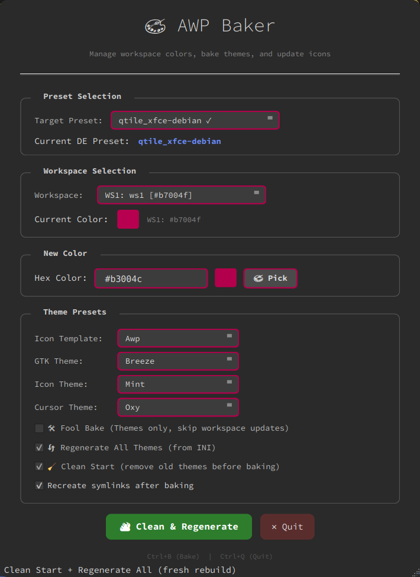

# AWP - Desktop Alchemy 🧪✨

[](https://python.org)
[](https://qt.io)
[](https://github.com/wedel-tech-art/awp-automated-wallpaper)
[](LICENSE)

## 🎯 What is Desktop Alchemy?

Most wallpaper managers rotate images.
AWP **transmutes** your entire desktop environment.

Each workspace becomes a distinct visual identity — with its own themes, icons, cursors, and wallpapers — all synchronized through a unified, intelligent architecture. From a single color, AWP **bakes** complete GTK and icon themes, creating harmony across your entire system.

## 🚀 Key Features

## 🧁 AWP Baker — The Ultimate Theme Generation Tool (V3.11)

AWP Baker (`baker`) is a **standalone, surgical theme generation tool** that changes how you manage workspace colors forever.

### ✨ What Makes Baker Special

- **Color-Driven Design:** Pick ANY hex color → Instant SVG-based icon → Bake GTK + Icons + Cursors in one click.
- **Surgical Precision:** Update ONE workspace at a time — no more waiting for all 8 workspaces to rebuild.
- **Multi-Preset Support:** Work with ANY preset (current or not). Prepare themes for other DEs before switching.
- **SVG Template System:** Beautiful folder-style icons with 7+ templates (AWP, Debian, Ubuntu, Mint, KDE, GNOME, Plasma).
- **Fool Bake Mode:** Pure theme baking without touching your config — perfect for testing.
- **Regenerate All:** Rebuild ALL themes from the INI file in one operation.
- **Clean Start:** Remove ALL old themes before regenerating for a fresh start.
- **Progress Bar:** Visual feedback with dynamic accent color matching.
- **Dark Theme with Dynamic Accents:** The UI adapts to your selected hex color in real-time.

### 🎨 SVG Templates

| Template | Description |
|----------|-------------|
| **awp** | Custom AWP logo (stylized "AWP" in one stroke) |
| **debian** | Debian swirl, classical |
| **swirldeb** | Debian swirl + "debian" text (balanced design) |
| **ubuntu** | Ubuntu circle of friends logo |
| **mint** | Linux Mint leaf logo |
| **kde** | KDE gear logo |
| **gnome** | GNOME foot logo |
| **plasma** | Plasma/KDE logo |

### 🎮 Baker Workflow

```bash
# Launch baker from terminal
python3 ~/awp/baker
```

## 🧬 Color Engine Evolution V3.10

- **Smart Selection Dimmer:** A global brightness control (`SELECTION_BRIGHTNESS`) automatically darkens selection backgrounds across all GTK themes and Qt6/KDE apps to 75% (assignable) brightness. This ensures white text remains perfectly readable even with extreme accent colors (like bright yellow), while maintaining the color's personality. The dimmer is applied uniformly across Breeze, Colloid, Graphite, Flat-Remix, and the AWP Dashboard — a single variable controls everything, even QT/KDE accents as well.

- **Refactored Color Engine:** Pure color math (hex ↔ HSV conversions, hue shifts, saturation/value scaling) has been extracted to `core/utils.py` for improved modularity and testability. Replacement logic is now split between `_build_gtk_replacements()` (with trap zone logic for XFWM buttons) and `_build_icon_replacements()` (pure color math with enhancer support).

- **Standardized Ratios:** All `family_ratios` presets now use a unified 3-value format `(hue_shift, sat_ratio, val_ratio)`. This eliminates the "expected 3, got 2" error and simplifies the color calculation pipeline across GTK and icon themes.

- **Independent Icon Preset Definitions:** Each icon preset now has its own dedicated `colors` and `family_ratios` definition in `ICON_PRESETS`. This replaces the shared `_PURPLE` dictionary, allowing each preset to express its unique color personality — from the rich 5-color Mint to the minimal 1-color Neon.

- **Mint Preset Rebuilt (Mostly SVG):** The `mint` preset has been completely rebuilt from the ground up. Most assets were replaced with original SVG artwork, with only a few supplementary PNG assets retained for audio and emblem icons.

- **Sweet-Hollow Preset:** A new modern variant of the `sweet` family featuring hollow-body folders and a neon-inspired aesthetic. Perfect for users who want the sweet icon style with a lighter, more transparent visual footprint.

- **`deepest` Color Added:** A new ultra-dark decoration color (`#2c1e44`) has been added to the Mint preset for enhanced depth and contrast in decorative icon elements.

- **Enhanced Icon Color Personalities:** Per-preset color analysis reveals distinct personalities:
  - `mint`: 5 colors (richest palette with deep shadows)
  - `rami`: 4 colors (balanced with warm highlights)
  - `adwaitaru`: 3 colors (dark with bright and airy labels)
  - `slot-multicolor`: 3 colors (dark and simple)
  - `breeze`/`sweet`/`sweet-hollow`: 2 colors (clean and minimal)
  - `neon`: 1 color (effect-based minimalism)

## 🔆 Daemon Modes V3.9

AWP offers two daemon operation modes for Desktop Environments:

### Full Daemon (Default)
- Rotates wallpapers based on timing settings
- Preloads the next wallpaper for smooth transitions
- Best for desktops where automated rotation is desired

### Light Daemon (No Rotation)
- Sets wallpaper once per workspace
- No timer overhead and lower CPU usage (ideal for laptops)
- Preserves the complete theming pipeline

**How to use:** Create a preset with the `_light` suffix (for example `xfce_light-debian`) and AWP automatically switches to the light daemon while preserving all theming capabilities. Both modes share the same backend architecture with zero code duplication. The `_light` suffix instructs AWP to use `daemon-light.py` instead of `daemon.py`.

Run either mode from `~/awp`:

```bash
# Full daemon preset
./awp_start.sh xfce-debian

# Light daemon preset (no rotation)
./awp_start.sh xfce_light-debian
```

## 🎨 GTK, Icon & Cursor Preset System V3.8

- **Cursor Preset System:** Added cursor baking support through `template-cursor-presets/`, introducing the `oxy` preset based on Oxygen cursors for synchronized workspace identity.

- **Multi-Preset Architecture:** Replaces the original single-template model with selectable GTK, Icon and Cursor preset layers.

- **Dual-Phase Core Modulation (Enhanced Color Fidelity):** The theme engine performs precise dual-phase calculations, dynamically extracting color relationships to modulate assets (PNG/SVG) while preserving native gradients and maximizing fidelity relative to the active workspace identity color.

- **Dynamic Icon Reconstruction Engine:** Icon presets now store canonical PNG/SVG source assets and use a high-speed RAM workspace (`/dev/shm`) to minimize disk usage during generation.

- **Expanded Preset Library:** Includes mint, `slot-multicolor`, rami, neon, adwaitaru, and the scalable `breeze` and `sweet` presets supporting hybrid PNG/SVG baking workflows.

- **On-the-Fly Manifests:** Icon themes generate clean `index.theme` files and complete XDG directory structures during the bake process.

- **Scalable SVG Support:** SVG-capable presets generate proper `scalable/` XDG icon directories alongside traditional PNG sizes.

- **Expanded Coverage:** Presets extend beyond Places into Devices, Legacy and Mimetypes, including Debian packages (`.deb`), Writer/Word documents, Calc/Excel spreadsheets, and Impress/PowerPoint presentations across OpenDocument, OpenXML and Microsoft standards.

- **Manifest-Driven Expansion:** New icons and categories are managed through centralized dictionaries in `core/constants.py`.

- **Unified Icon Registry (`ICON_REGISTRY`):** All icon metadata — context, PNG actions, SVG originals and symlink aliases — lives in a single source-of-truth registry. Manifest generation derives directly from this structure for simplified expansion and maintenance.

- **Hybrid PNG/SVG Pipeline:** The baking engine supports PNG modulation and SVG direct color replacement in a unified pass.

- **SVG Encoding Normalization:** Template SVGs are validated for UTF-8 encoding and normalized dimensions to prevent silent GTK rendering failures.

- **Unified Text Substitution (`gtkrc` & XFWM4 SVGs):** GTK2 configuration files and XFWM4 vector assets are normalized against a shared accent source to eliminate mismatched transitions and preserve visual continuity.

- **Automated Artifact Cleanup:** Removes unnecessary generated artifacts (`thumbnail.png`, `preview.png`, etc.) to keep output themes lightweight.

- **GTK Preset Variants:**
  - `breeze` (default): PNG modulation + CSS/SVG replacement with full XFWM4 support.
  - `flat-remix`: High-density layout with normalized asset scaling and accent-aware XFWM4 controls.
  - `colloid` & `graphite`: CSS/SVG-first recoloring for GTK3/4 with selective GTK2 PNG support and improved XFWM4 inactive-state handling.

- **Window Control Accent Logic:** XFWM4 controls apply adaptive color progression — Close uses the workspace accent, Maximize shifts ±25%, and Minimize ±50% depending on brightness to preserve contrast and balance.

- **Preset-Based Theme Baking:** `bake_awp_theme()` supports preset generation using `awp-gtk-{preset}-{hex}` naming.

- **Dashboard Integration:** GTK, Icon and Cursor presets can be selected per workspace in `dab.py`, with sorted preset selection and live HUD integration enabling synchronized visual identity across all theme layers.

- **Lean & Maintainable:** Presets remain lightweight and act as the single source of truth.

## ⚡ Low-Latency State Bridge & Logic V3.7

- **RAM-Backed Sync:** The system now utilizes `/dev/shm/qtile_current_ws` as a high-speed "Single Source of Truth," allowing the Window Manager to push workspace states directly to AWP.

- **Zero-Lag Transmutation:** By reading state from RAM, theme and wallpaper updates are triggered instantaneously upon workspace transition, eliminating polling delays and reducing CPU overhead.

- **"Park" Action:** A new 7th navigation command in `nav.py` allows manual wallpaper application based on the current index without cycling through the library.

- **Daemon-Less Mode:** Upgraded `awp_start.sh` with a conditional toggle to skip starting the background daemon, optimized for self-theming environments like Qtile.

- **Backend-Driven Logic:** Core actions are now delegated to specific backends (like `qtile_xfce.py`), ensuring perfect synchronization between the WM and the AWP dashboard.

- **Unified Qt6/GTK Aesthetics:** All backends now synchronize Qt6 accent colors in real-time via `/dev/shm` symlinks. This ensures Qt6 applications match your workspace's GTK "signature" with zero disk writes.

- **Unified Printer System:** All terminal output now flows through `core/printer.py` – no more scattered color codes. Context-aware prefixes (`[AWP-backends]`, `[AWP-daemon]`, etc.) provide professional, color-coded logs across all components with zero duplication.

- **Genetic Theme & Icon Generation:** Analyzes workspace icons to physically "bake" both custom GTK themes (`~/.themes`) and Icon themes (`~/.icons`) simultaneously. Uses the "Mom" inheritance (`awp-icon-mom`) for procedural hue-shifting based on Mint-Y architecture. Features real-time hover-to-hex color extraction in the dashboard.

### 🚀 Desktop Environment Support

| Environment | Wallpaper | Icons | GTK | Cursors | WM Theme | Desktop Theme |
|-------------|-----------|-------|-----|---------|----------|---------------|
| **XFCE** | ✅ | ✅ | ✅ | ✅ | ✅ | ❌ |
| **Qtile/XFCE** | ✅ | ✅ | ✅ | ✅ | ❌ | ❌ |
| **Cinnamon** | ✅ | ✅ | ✅ | ✅ | ✅ | ✅ |
| **GNOME** | ✅ | ✅ | ✅ | ✅ | ❌ | ❌ |
| **MATE** | ✅ | ✅ | ✅ | ✅ | ✅ | ❌ |
| **Generic WM** | ✅ | ⚠️ | ⚠️ | ⚠️ | ❌ | ❌ |

> 💡 **Light Mode:** Presets with `_light` suffix use the same backends but with a lightweight daemon (no wallpaper rotation). All theming features work identically. Add `_light` to any preset name to enable.

> ⚠️ Generic WM support depends on gsettings availability

## 🚀 Quick Start (Presets and Symlinks Technology)

### 📦 Prerequisites

# Install System Tools & Python Bindings
```
sudo apt update
sudo apt install imagemagick python3-pyqt6 feh librsvg2-bin
```

# ⚡ Installation & First Run

For AWP to function correctly, the main directory must be named awp and reside in your home folder.

# Clone the repository
```
git clone [https://github.com/wedel-tech-art/awp-automated-wallpaper.git](https://github.com/wedel-tech-art/awp-automated-wallpaper.git)
mv awp-automated-wallpaper/awp ~/awp
cd ~/awp
```

### Use the startup script with TEMPLATE
```
Once you have awp as ~/awp then you can open a terminal there and do:
./awp_start.sh TEMPLATE (this will start your AWP with default values for a typical 4 workspaces OS)
The format is ./awp_start.sh [PRESET_NAME] so you can have your own presets all with different values, the possibilities are endless.
```
### Creating a Light Preset (No Wallpaper Rotation)

```bash
# Clone an existing preset
cp -r ~/awp/presets/xfce-debian ~/awp/presets/xfce_light-debian

# Rename the INI file to match
mv ~/awp/presets/xfce_light-debian/xfce-debian.ini \
   ~/awp/presets/xfce_light-debian/xfce_light-debian.ini

# Use it with the light daemon
./awp_start.sh xfce_light-debian
```

## 🎮 Usage

### Baker (New Theme Tool)
```
In ~/awp do "./baker" for surgical theme generation and color management.
```

### Dashboard Qt6
```
In ~/awp you do "python3 dab.py" for editing all default values and make AWP really "your own".
```

## Manual Navigation

### Next wallpaper
```
python3 nav.py next
```
### Previous wallpaper
```
python3 nav.py prev
```
### Delete current wallpaper
```
python3 nav.py delete
```
### Sharpen current wallpaper (temporary, via ImageMagick)
```
python3 nav.py sharpen
```
### Apply saturation to wallpaper (temporary, via ImageMagick)
```
python3 nav.py color
```
### Convert wallpaper to black and white (temporary, via ImageMagick)
```
python3 nav.py black
```

### Recommended Keybindings

- `Super + Right` → Next wallpaper
- `Super + Left` → Previous wallpaper
- `Super + Delete` → Delete current wallpaper
- `Super + s` → Sharpen wallpaper
- `Super + c` → Colorize wallpaper
- `Super + b` → Convert wallpaper to black and white

> [!TIP]
> **Non-Destructive Editing:** Last 3 effects are applied to a temporary copy in the `awp/` folder. The original wallpaper remains untouched. If you love a modified version (e.g., a sharpened or B&W version), you can manually replace the original file in your library with the processed one from the `awp/` directory.

## 🛠️ Configuration
```
Use the dashboard:
python3 dab.py
```

## Screenshots

### General Settings


### Workspace 1 Configuration


### Workspace 2 Configuration


### Workspace 3 Configuration


### Baker - Theme Generator


*Baker's main interface showing workspace selection, color picker, and theme presets.*


## 📁 Project Structure
```
awp-automated-wallpaper/
├── awp/                            # Main Application Directory
│   ├── baker                       # 🧁 AWP Baker (Fast theme generator)
│   ├── core/                       # Centralized business logic
│   │   ├── actions.py              # Core wallpaper operations
│   │   ├── config.py               # Configuration management
│   │   ├── constants.py            # Paths, colors, capability matrix
│   │   ├── printer.py              # 🖨️ Unified printing system (V3.6)
│   │   ├── runtime.py              # Runtime state management
│   │   ├── themes.py               # Theme baking engine (Genetic logic)
│   │   └── utils.py                # Utility functions
│   ├── backends/                   # Desktop environment backends
│   │   ├── __init__.py             # Dynamic backend factory
│   │   ├── xfce.py                 # XFCE backend (with orchestrator)
│   │   ├── qtile_xfce.py           # Qtile/XFCE hybrid
│   │   ├── cinnamon.py             # Cinnamon backend
│   │   ├── gnome.py                # GNOME backend
│   │   ├── mate.py                 # MATE backend
│   │   └── generic.py              # Generic WM fallback
│   ├── presets/                    # Identity Robbery Presets 🎭
│   │   ├── TEMPLATE/               # Generic self-healing baseline
│   │   └── [preset_name]/          # Custom user-defined identities
│   ├── presets-backup/             # Pre-flight safety mirror 🛡️
│   ├── template-theme-presets/     # GTK
│   ├── template-icon-presets/      # PNG's + scalable SVG's
│   ├── template-cursor-presets/    # Cursor preset templates (currently oxy)
│   ├── awp-icon-mom/               # The "Mother" icon template
│   ├── awp-logos.tar.gz            # 6 folders with 360 AWP icons PNG/SVG
│   ├── logos/                      # Active workspace icons (symlinks)
│   ├── daemon.py                   # Full background service (with rotation)
│   ├── daemon-light.py             # Light background service (no rotation)
│   ├── dab.py                      # Qt6 Dashboard
│   ├── nav.py                      # Navigation controller
│   ├── hud_vertical.py             # Sidebar system monitor
│   ├── hud_bottom.py               # Bottom dock monitor
│   ├── awp_setup.py                # Setup wizard (Legacy fallback)
│   └── awp_start.sh                # Identity manager & startup script
├── screenshots/                    # GitHub previews
├── .gitignore
├── LICENSE
└── README.md
```
### 📅 Version Timeline

| Version | Date | Key Feature |
|---------|------|-------------|
| **V3.11** | Jul 2026 | 🧁 AWP Baker — Standalone color & theme generator with SVG templates, multi-preset support, surgical operations, and progress bar |
| **V3.10** | Jun 2026 | 🧬 Color Engine Evolution — Refactored color math, independent icon presets, SVG-based Mint rebuild, Sweet-Hollow preset, standardized 3-value ratios |
| **V3.9** | Jun 2026 | 🔆 Light Daemon Mode — `_light` preset suffix for no-rotation operation, shared backends, zero duplication |
| **V3.8** | May 2026 | 🎨 GTK & Icon Preset System — Unified `ICON_REGISTRY`, hybrid PNG/SVG baking pipeline, scalable XDG icon tree with auto-generated symlinks, and mathematically pure SVG color replacement |
| **V3.7** | Mar 2026 | ⚡ Backend Logic Delegation + State Consolidation |
| **V3.6** | Feb 2026 | 🖨️ Unified Printer System + 🖱️ Cursor Refresh + 🧠 Capability Matrix |
| **V3.5** | Feb 2026 | 🧬 Dual-Genetic Baking (Themes + Icons) |
| **V3.4** | Feb 2026 | 🏗️ Core Consolidation (Zero Duplication) |
| **V3.3** | Feb 2026 | 🛰️ Runtime State Engine + Native HUDs |
| **V3.2** | Feb 2026 | 🔍 Surgical Precision + Hover-to-Hex |
| **V3.1** | Feb 2026 | 🔌 Universal Logic + Core Sanitization |
| **V3.0** | Jan 2026 | 🧠 Genetic Intelligence + Qt6 |
| **V2.2** | Jan 2026 | ⚡ Lean Mode + Hybrid Backends |
| **V2.1** | Jan 2025 | 🧰 Centralized Utilities |

## 🔧 Troubleshooting

### Baker not generating icons?
- Ensure `rsvg-convert` is installed: `sudo apt install librsvg2-bin`
- Check that SVG templates exist in `core/constants.py`
- Try Fool Bake mode to isolate the issue

### Light daemon not working?
- Ensure your preset name ends with `_light-debian` (e.g., `xfce_light-debian`)
- Check that `LIGHT_DAEMON_LIST` in `awp_start.sh` includes your preset
- The same backend works for both full and light modes - no extra files needed

### Missing Printer Prefixes?
If you see `[AWP]` instead of `[AWP-xfce]` or similar, ensure:
- You're using the latest version (V3.6+)
- The printer is properly imported in each module
- Backend functions pass `backend="name"` parameter

### Themes Not Applying?
- Run `dab.py` and click **Sync Themes** to bake missing themes
- Check `~/.themes/` and `~/.icons/` for generated folders
- Ensure your DE is correctly detected in `awp_config.ini`

### Dashboard Shows Greyed Out Options?
That's normal! The UI intelligently disables options your DE doesn't support:
- **Window Theme**: Only for XFCE, MATE, Cinnamon
- **Desktop Theme**: Only for Cinnamon

## 🤝 Contributing

Contributions are welcome! Please feel free to submit pull requests or open issues for bugs and feature requests.

## 📄 License

This project is licensed under the MIT License — see the LICENSE file for details.

### 📦 AWP Logos Asset Package

AWP includes a comprehensive asset package (`awp-logos.tar.gz`) containing **3 distinct AWP logo designs**, each available in **SVG and PNG formats**, across **360 carefully curated colors**.

```
📦 awp-logos.tar.gz
├── logos-awp-svg/                          # Scalable Vector Graphics
│   ├── awp-assets-{hue}-{color}.svg        # Design 1 × 360 colors
├── logos-dark-svg/                         # Scalable Vector Graphics
│   ├── awp-dark-{hue}-{color}.svg          # Design 2 × 360 colors
├── logos-firma-svg/                        # Scalable Vector Graphics
│   ├── awp-firma-{hue}-{color}.svg         # Design 3 × 360 colors
├── logos-awp-png/                          # PNG renders (512x512)
│   ├── awp-assets-{hue}-{color}.png        # Design 1 × 360 colors
├── logos-dark-png/                         # PNG renders (512x512)
│   ├── awp-dark-{hue}-{color}.png          # Design 2 × 360 colors
└── logos-firma-png/                        # PNG renders (512x512)
    └── awp-firma-{hue}-{color}.png         # Design 3 × 360 colors
```

**3 designs × 360 colors × 2 formats = 2,160 unique icons!** 🎨

### 🎨 The 3 AWP Designs

| Design | Description |
|--------|-------------|
| **logos-awp** | Classic AWP logo — stylized "AWP" in one continuous stroke |
| **logos-dark** | Alternative AWP logo — black background colored "AWP" logo |
| **logos-firma** | No background, just the AWP "signature" — contemporary take on the AWP identity |

> 💡 These designs are **original AWP creations**, available for use with any AWP workspace. The SVG versions are fully scalable, while the PNG versions are pre-rendered at 512x512 for immediate use.

### 🙏 Tribute & Inspiration

The SVG templates in AWP Baker are a tribute to the open-source community:

- **Debian** — For the philosophy of freedom
- **Ubuntu** — For making Linux accessible to millions
- **Linux Mint** — For the elegant Mint-Y theme
- **KDE** — For the Plasma desktop and Breeze theme
- **GNOME** — For the clean, minimalist design philosophy

> 💙 **"We stand on the shoulders of giants."** — All community tribute templates are created as artistic reinterpretations, not endorsed by or affiliated with their respective projects.

### Visual Preset Credits (Icons, GTK & Cursor Themes)

AWP includes modified and adapted visual presets derived from the following open-source projects and redistributed and/or transformed under their respective licenses.

| Preset | Category | Based On | Author | License | Source |
| :--- | :--- | :--- | :--- | :--- | :--- |
| slot-multicolor | Icon | Slot-Multicolor-Dark-Icons | L4ki | GPLv3 | [GitHub](https://github.com/L4ki/Slot-Plasma-Themes) |
| breeze | Icon | Breeze Chameleon Dark (KDE) | L4ki | GPLv3 | [GitHub](https://github.com/L4ki/Breeze-Chameleon-Icons) |
| sweet | Icon | Sweet (filled variant) | EliverLara | GPLv3 | [GitHub](https://github.com/EliverLara/Sweet) |
| sweet-hollow | Icon | Sweet (hollow variant) | EliverLara | GPLv3 | [GitHub](https://github.com/EliverLara/Sweet) |
| adwaitaru | Icon | Adwaitaru | ricardoherreramx | GPLv3 | [GitHub](https://github.com/ricardoherreramx/adwaitaru) |
| mint | Icon | AWP Original + some added SVG/PNG | AWP Original + Various | MIT/GPLv3 | Built from scratch |
| neon | Icon | Royal-Z / Neon | SethStormR | GPLv3 | [GitHub](https://github.com/SethStormR/Royal-Z) |
| rami | Icon | Rami (based on Kora) | Rami | GPLv3 | [Gnome-Look](https://www.gnome-look.org/p/2216265) |
| besgnulinux | Icon | Besgnulinux Icon Theme | besgnulinux | **Custom Permission (GPL-compatible)** | [Gnome-Look](https://www.gnome-look.org/p/1832128) |
| breeze | GTK | Breeze GTK | KDE Community | LGPL / GPL | [Website](https://kde.org) |
| colloid | GTK | Colloid GTK Theme | vinceliuice | GPLv3 | [GitHub](https://github.com/vinceliuice/Colloid-gtk-theme) |
| flat-remix | GTK | Flat Remix GTK | daniruiz | GPLv3 | [GitHub](https://github.com/daniruiz/flat-remix-gtk) |
| graphite | GTK | Graphite GTK | vinceliuice | GPLv3 | [GitHub](https://github.com/vinceliuice/Graphite-gtk-theme) |
| oxy | Cursor | Oxygen Cursors | KDE Community | LGPL / GPL | [Website](https://kde.org) |

> ℹ️ **Mint Icon Preset (AWP Original):** The `mint` preset included in AWP is **not** a direct copy of Mint-Y-Purple. It is a **completely original SVG-based rebuild** created from scratch and made to resemble Mint-Y-Purple but using svg folder structures inspired by `slot-multicolor` and label/emblem design language from `adwaitaru`. While the name pays homage to the Linux Mint aesthetic, the artwork, gradients, and color relationships are original AWP creations.

> ℹ️ **Sweet/Sweet-Hollow Presets:** Both presets are derived from the original Sweet icon theme by EliverLara. `sweet` uses the filled variant, while `sweet-hollow` uses the hollow variant with modified color relationships for a neon-inspired aesthetic. Both are redistributed under GPLv3.

> ℹ️ **Besgnulinux Preset:** Used with explicit permission from the creator (besgnulinux) who stated: *"You can share them or make changes to them."* Modified and enhanced for AWP Icon Presets. Original design available at [Gnome-Look](https://www.gnome-look.org/p/1832128/).

> ℹ️ **DeepMacOS Preset:** Trash icons used from the DeepMacOS IconTheme, distributed under GPLv3. Original design available at [OpenDesktop](https://www.opendesktop.org/p/2104775).

AWP does not claim ownership of bundled visual assets. Icon, GTK and cursor presets remain under their respective upstream licenses and are redistributed and/or modified in accordance with those terms.

## 🙏 Acknowledgments

- Built with Python 3 and PyQt6.
- Tested on Linux Mint XFCE, Debian, and other major distributions.
- Theme, cursor and visual preset workflows are inspired by the excellent work of the KDE, Linux Mint, XFCE, GNOME and wider Linux desktop communities.
- **Visual Preset Credits:** slot-multicolor (L4ki), breeze (L4ki/KDE), sweet & sweet-hollow (EliverLara), adwaitaru (ricardoherreramx), neon (SethStormR), rami (Rami author), **besgnulinux (besgnulinux)**, **deepmacos (mirabellalorenzo03)**, colloid (vinceliuice), flat-remix (daniruiz), graphite (vinceliuice), and Oxygen Cursors (KDE Community). See the License section for full attribution details.
- **Special Credit:** The AWP `mint` icon preset is an **original AWP creation** — rebuilt from scratch with most assets converted to original SVG artwork. Distributed under the MIT License as part of AWP.
- **AWP Logo Designs:** The 3 AWP logo designs in `awp-logos.tar.gz` are original creations. Available in SVG and PNG formats across 360 colors.
- **SVG Templates:** The AWP Baker SVG templates (awp, debian, swirldeb, ubuntu, mint, kde, gnome, plasma) are artistic reinterpretations created as tributes to the open-source projects that inspire us.
- Special thanks to the open-source community and all AWP users.
