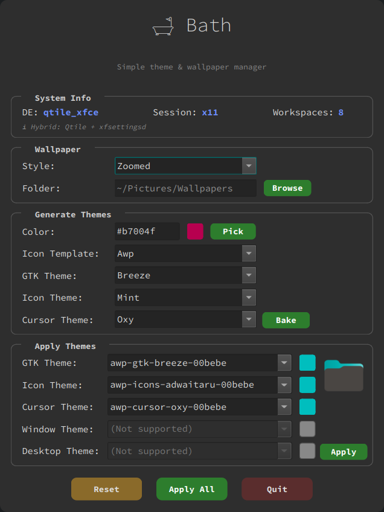
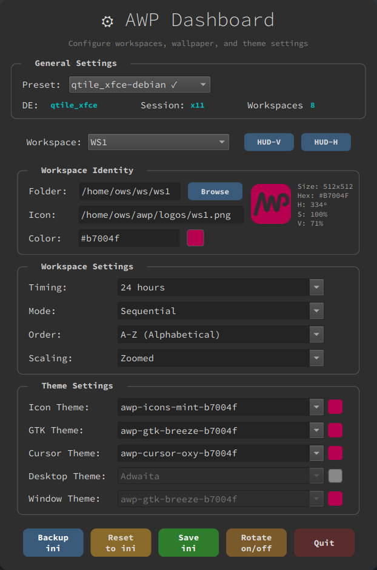
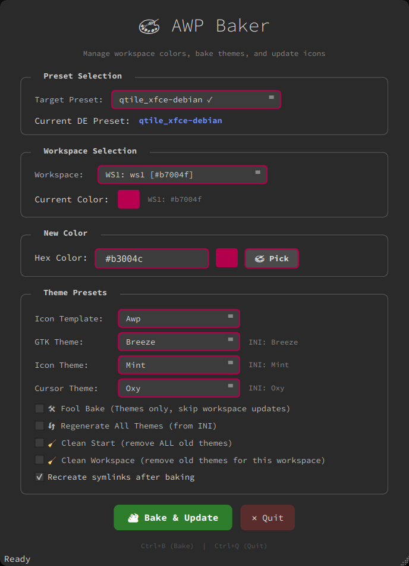

# AWP - Desktop Alchemy 🧪✨

[](https://python.org)
[](https://qt.io)
[](https://github.com/wedel-tech-art/awp-automated-wallpaper)
[](LICENSE)

## 🎯 What is Desktop Alchemy?

Most wallpaper managers rotate images.
AWP **transmutes** your entire desktop environment.

Each workspace becomes a distinct visual identity — with its own themes, icons, cursors, and wallpapers — all synchronized through a unified, intelligent architecture. From a single color, AWP **bakes** complete GTK and icon themes, creating harmony across your entire system.

## 🚀 Key Features

### 🛁 Bath — "A Taste of AWP" Newbie-Friendly Baker-Themer (V3.15)

**Bath** is a standalone tool that gives users a **taste** of what AWP can do — without the complexity of presets, workspaces, or INI files.

- **One-Stop Shop:** GTK themes, icon themes, cursor themes, wallpaper, and screen blanking — all in one window
- **On-the-Fly Theme Baking:** Pick any color and instantly bake a complete theme (GTK + Icons + Cursors)
- **Live Icon Preview:** See exactly what your icon theme looks like before applying it
- **Backend-Aware:** Automatically detects your DE and adapts theme application accordingly
- **System-Level Only:** Works with your current system themes — no presets, no workspaces, no complexity
- **Real-Time Feedback:** Color picker, previews, and immediate system updates

> 💡 **Bath is the gateway drug to AWP.** It's designed to show new users the power of AWP's theming engine without overwhelming them. Once you need more control (multiple workspaces, different wallpapers, presets), you graduate to **DAB + Baker**.

### 🔧 DAB — Pure Configurator (The Real Power Tool)

**DAB** is the workhorse of AWP — full preset management, workspace configuration, and system control.

- **Full Preset Access:** Switch between any preset from `presets/` directly from the dashboard
- **Tab-Free UI:** Clean, modern single-window design with workspace combo box
- **Live Theme Previews:** Color previews for GTK, Icon, and Cursor themes
- **HUD Integration:** Toggle Vertical and Horizontal (Bottom) upgraded HUDs with real-time mount detection and screen size auto-detection as well
- **Preset Indicator:** ✓ mark shows which preset is currently active in your system
- **Screen Blanking:** Simple combo box control (unified, no confusing checkboxes)
- **Modern Action Buttons:** Color-coded actions matching Baker's sleek style

> 💡 **DAB is for power users.** It's the central control panel for managing multiple presets, configuring workspaces, and controlling the entire AWP ecosystem.

### 🧁 AWP Baker — Ultimate Theme Generation

**Baker** is a surgical theme generation tool with live previews and intelligent operations.

- **Live Icon Preview:** See exactly what your chosen icon template + color will look like before baking
- **Color Conflict Detection:** Prevents duplicate colors across workspaces
- **INI Theme Labels:** Shows current INI configuration for full context
- **Clean Workspace Mode:** Remove ONLY the current workspace's themes before baking
- **Fool Bake Mode:** Pure theme baking without touching your config — perfect for testing
- **Regenerate All:** Rebuild ALL themes from the INI file in one operation
- **Progress Bar:** Visual feedback with dynamic accent color matching

### 🎯 The Three Tools Work Together

| Tool | Purpose | Best For | Complexity |
|------|---------|----------|------------|
| **Bath** | System-wide theming (taste of AWP) | New users, quick theme changes, "just make it look good" | 🟢 Low |
| **DAB** | Configuration & presets | Power users managing multiple presets and workspaces | 🟡 Medium |
| **Baker** | Theme generation | Creating custom themes from colors, surgical operations | 🟡 Medium |

> 🔄 **The Workflow:** Try **Bath** first to see what AWP can do. If you like it, graduate to **DAB + Baker** for the full power of workspace-specific theming, presets, and automated wallpaper rotation.

## 🔧 Dashboard Upgrade & Baker Enhancements (V3.14)

**DAB now features presets** with a tab-free UI and preset indicator.

- **Preset Switching:** Select any preset from `presets/` directly from the dashboard
- **Tab-Free UI:** Clean single-window design with workspace combo box
- **Modern Action Buttons:** Color-coded actions matching Baker's style
- **Preset Indicator:** ✓ mark shows active preset (from `/dev/shm/awp_active_preset`)
- **HSV Display in Baker:** Better color understanding with Hue/Saturation/Value info
- **Symlink Cleanup:** Consistent naming across backends

> 💡 **Recommended Workflow:** Use **DAB** for configuration and preset selection, **Baker** for theme generation.

## 🔧 DAB Pure Configurator & New Tools (V3.13)

**DAB is now exclusively a configuration tool** — no baking, no color detection.

- **DAB Pure Configurator:** Handles folders, timing, scaling, blanking, and system themes
- **preset_cloner.sh:** Clone current preset to ALL or specific presets
- **awp_rotate.sh:** Toggle wallpaper rotation (full ↔ light daemon)
- **Icon Path Enforcement:** All icons point to `~/awp/logos/` — presets are fully portable
- **New GTK Preset:** `mint` based on Mint-Y-Dark-Aqua
- **New SVG Template:** `awp-firma` — AWP signature stroke with transparent background

## 🎨 Preset-Based Themes (V3.12)

**Themes now live inside presets** — each preset is completely self-contained.

- **Themes stored in** `presets/PRESET/themes/` (GTK, Icons, Cursors)
- **Activation via symlinks** — `awp_start.sh` links to `~/.themes` and `~/.icons`
- **Clean separation** — Baked themes never conflict with system themes
- **Portable presets** — Share entire presets with baked themes included

**TEMPLATE Showcase:** 4 workspaces, 4 different themes demonstrating AWP's full power.

| Workspace | Color | GTK | Icons | Cursors |
|-----------|-------|-----|-------|---------|
| ws1 | `#00a3b3` | Breeze | Mint | Oxy |
| ws2 | `#b39b00` | Flat-Remix | Adwaitaru | Oxy |
| ws3 | `#b3004c` | Breeze | Besgnulinux | Oxy |
| ws4 | `#8300b3` | Breeze | Sweet | Oxy |

**Benefits:** No cluttering `~/.themes`/`~/.icons`, clean symlink management, portable/shareable presets, surgical updates.


## 🧬 Core Engine Evolution (V3.7 - V3.11)

### V3.11 — AWP Baker Launch
**Baker** debuted as a standalone surgical theme generation tool, introducing:
- **Color-Driven Design:** Pick any hex → bake GTK + Icons + Cursors in one click
- **Surgical Precision:** Update ONE workspace at a time — no rebuilding all 8
- **Multi-Preset Support:** Work with ANY preset (current or not)
- **SVG Template System:** 9 templates (AWP, Debian, Ubuntu, Mint, KDE, GNOME, Plasma, etc.)
- **Fool Bake / Regenerate All / Clean Start / Clean Workspace** modes

### V3.10 — Color Engine Evolution
- **Smart Selection Dimmer:** Global brightness control (`SELECTION_BRIGHTNESS`) ensures white text remains readable with extreme colors
- **Refactored Color Engine:** Pure color math extracted to `core/utils.py` (hex ↔ HSV conversions, hue shifts)
- **Standardized Ratios:** All presets use unified `(hue_shift, sat_ratio, val_ratio)` format
- **Independent Icon Presets:** Each preset has its own `colors` and `family_ratios` definition
- **Mint Preset Rebuilt:** SVG-based rebuild with original artwork
- **Sweet-Hollow Preset:** New neon-inspired variant
- **Per-Preset Color Personalities:** Rich 5-color Mint to minimal 1-color Neon

### V3.9 — Light Daemon Mode
- `_light` preset suffix for no-rotation operation
- Same backends, zero code duplication
- Perfect for laptops or manual wallpaper control

### V3.8 — GTK, Icon & Cursor Preset System
- **Cursor Preset System:** `oxy` preset based on Oxygen cursors
- **Multi-Preset Architecture:** Selectable GTK, Icon, and Cursor presets
- **Dual-Phase Core Modulation:** PNG/SVG modulation preserving native gradients
- **Dynamic Icon Reconstruction Engine:** RAM workspace (`/dev/shm`) for minimal disk usage
- **Expanded Preset Library:** mint, slot-multicolor, rami, neon, adwaitaru, breeze, sweet
- **Unified Icon Registry (`ICON_REGISTRY`):** Single source of truth for all icon metadata
- **Hybrid PNG/SVG Pipeline:** PNG modulation + SVG direct color replacement
- **GTK Preset Variants:** breeze, flat-remix, colloid, graphite with XFWM4 support
- **Window Control Accent Logic:** Adaptive color progression for XFWM4 buttons

### V3.7 — Low-Latency State Bridge & Logic
- **RAM-Backed Sync:** `/dev/shm/qtile_current_ws` as high-speed "Single Source of Truth"
- **Zero-Lag Transmutation:** Theme/wallpaper updates trigger instantaneously
- **"Park" Action:** Manual wallpaper application without cycling
- **Backend-Driven Logic:** Core actions delegated to specific backends
- **Unified Qt6/GTK Aesthetics:** Qt6 accent colors sync via `/dev/shm` symlinks
- **Unified Printer System:** Professional color-coded logs across all components
- **Genetic Theme & Icon Generation:** "Mom" inheritance (`awp-icon-mom`) for procedural hue-shifting

### 🚀 Desktop Environment Support

| Environment | Wallpaper | Icons | GTK | Cursors | WM Theme | Desktop Theme |
|-------------|-----------|-------|-----|---------|----------|---------------|
| **XFCE** | ✅ | ✅ | ✅ | ✅ | ✅ | ❌ |
| **Qtile/XFCE** | ✅ | ✅ | ✅ | ✅ | ❌ | ❌ |
| **Cinnamon** | ✅ | ✅ | ✅ | ✅ | ✅ | ✅ |
| **GNOME** | ✅ | ✅ | ✅ | ✅ | ❌ | ❌ |
| **MATE** | ✅ | ✅ | ✅ | ✅ | ✅ | ❌ |
| **Generic WM** | ✅ | ⚠️ | ⚠️ | ⚠️ | ❌ | ❌ |

> 💡 **Light Mode:** Presets with `_light` suffix use the same backends but with a lightweight daemon (no wallpaper rotation). All theming features work identically. Add `_light` to any preset name to enable.

> ⚠️ Generic WM support depends on gsettings availability

## 🚀 Quick Start (Presets and Symlinks Technology)

### 📦 Prerequisites

# Install System Tools & Python Bindings
```
sudo apt update
sudo apt install imagemagick python3-pyqt6 feh librsvg2-bin
```

# ⚡ Installation & First Run

For AWP to function correctly, the main directory must be named awp and reside in your home folder.

# Clone the repository
```
git clone [https://github.com/wedel-tech-art/awp-automated-wallpaper.git](https://github.com/wedel-tech-art/awp-automated-wallpaper.git)
mv awp-automated-wallpaper/awp ~/awp
cd ~/awp
```

### Use the startup script with TEMPLATE
```
Once you have awp as ~/awp then you can open a terminal there and do:
./awp_start.sh TEMPLATE (this will start your AWP with default values for a typical 4 workspaces OS)
The format is ./awp_start.sh [PRESET_NAME] so you can have your own presets all with different values, the possibilities are endless.
```
### Creating a Light Preset (No Wallpaper Rotation)

Manually clone and rename an existing preset:
```
# Clone an existing preset
cp -r ~/awp/presets/xfce-debian ~/awp/presets/xfce_light-debian
mv ~/awp/presets/xfce_light-debian/xfce-debian.ini \
   ~/awp/presets/xfce_light-debian/xfce_light-debian.ini
./awp_start.sh xfce_light-debian
```

## 🎮 Usage

## 🛁 Bath — "A Taste of AWP"

Bath is AWP's **gateway drug** — a simple, brainless tool that shows new users what AWP can do without overwhelming them with presets, workspaces, or INI files.

### ✨ Philosophy

Bath is **not** a replacement for DAB + Baker. It's a **taste** — a showcase of the theming engine that powers AWP. 

- **No Workspaces:** Just your current desktop
- **No Presets:** Works with your system as-is
- **No INI Files:** Everything is temporary and system-level
- **One Window:** All theming controls in one place

> 💡 **The Progression:** Bath → DAB → Baker. Start with Bath to see what's possible. When you need more control, move to DAB and Baker for the full AWP experience.

### 🎮 Bath Workflow

```
# Launch Bath
~/awp ./bath
```

## 🔧 DAB — The Power User's Dashboard

DAB is the central control panel for AWP. It's where you manage presets, configure workspaces, and control the entire AWP ecosystem.

### 🆕 HUD Integration

DAB now features **two HUDs** that can be toggled on/off directly from the dashboard:

- **HUD-V (Vertical):** Sidebar display showing current wallpaper, workspace info, and system stats
- **HUD-H (Horizontal):** Bottom dock display with real-time mount detection

**Features:**
- **One-Click Toggle:** Start/stop HUDs directly from DAB with the HUD-V and HUD-H buttons
- **Automatic Mount Detection:** HUDs now automatically detect and display mount information
- **State Persistence:** HUDs remember their state (on/off) across sessions
- **Keyboard Shortcuts:** `Ctrl+Shift+V` (HUD-V), `Ctrl+Shift+H` (HUD-H)

> 💡 **Why HUDs?** The HUDs provide at-a-glance information about your current workspace, wallpaper, and system state. Perfect for users who want real-time colorful feedback.

**Keyboard Shortcuts:**
- `Ctrl+B` — Backup INI
- `Ctrl+R` — Reset to INI
- `Ctrl+S` — Save INI
- `Ctrl+T` — Toggle rotation
- `Ctrl+Q` — Quit
- `Ctrl+Shift+V` — Toggle Vertical HUD
- `Ctrl+Shift+H` — Toggle Horizontal HUD

```
# Launch Dab
~/awp ./dab
```
## 🧁 AWP Baker — The Ultimate Theme Generation Tool

AWP Baker (`baker`) is a **standalone, surgical theme generation tool** that changes how you manage workspace colors forever.

### ✨ What Makes Baker Special

- **9 icon template presets** Pick from Adwaitaru, Neon, Mint, Breeze, Slot-Multicolor, Sweet, Sweet-Hollow, Rami, Besgnulinux.
- **5 GTK template presets** Pick from Mint, Breeze, Colloid, Graphite and Flat-Remix.
- **1 Cursor Template preset** Oxy Cursor Preset, based on Oxygen Cursors.
- **Color-Driven Design:** Pick ANY hex color → Instant SVG-based icon → Bake GTK + Icons + Cursors in one click.
- **Surgical Precision:** Update ONE workspace at a time — no more waiting for all 8 workspaces to rebuild.
- **Multi-Preset Support:** Work with ANY preset (current or not). Prepare themes for other DEs before switching.
- **SVG Template System:** Beautiful folder-style icons with 7+ templates (AWP, Debian, Ubuntu, Mint, KDE, GNOME, Plasma).
- **Fool Bake Mode:** Pure theme baking without touching your config — perfect for testing.
- **Regenerate All:** Rebuild ALL themes from the INI file in one operation.
- **Clean Start:** Remove ALL old themes before regenerating for a fresh start.
- **Clean Workspace:** Remove ONLY the current workspace's themes before baking — surgical cleanup.
- **Progress Bar:** Visual feedback with dynamic accent color matching.
- **Dark Theme with Dynamic Accents:** The UI adapts to your selected hex color in real-time.
- **INI Theme Labels:** Shows what themes are currently configured in the INI for full context.

### 🆕 Recent Enhancements

- **Icon Preview to be baked** Baker generates directly from svg templates how the new icon is going to look.
- **Clean Workspace Mode:** New checkbox to remove ONLY the current workspace's themes before baking — surgical cleanup without affecting other workspaces.
- **INI Theme Labels:** Theme presets now show what's currently configured in the INI file, giving you full context before making changes.
- **Adwaitaru Redesign:** The Adwaitaru icon preset has been updated with a more AWP-style aesthetic, maintaining its clean look while fitting the AWP design language.
- **Neon Preset Fixes:** All neon icons now have consistent color and opacity across the entire set for a more polished look.
- **Progress Bar Accent Color:** The progress bar now dynamically matches your selected hex color for a cohesive visual experience.

### 🎨 SVG Templates

| Template | Description |
|----------|-------------|
| **awp** | Custom AWP logo (stylized "AWP" in one stroke) |
| **awp-firma** | AWP signature stroke with transparent background |
| **debian** | Debian swirl, classical |
| **swirldeb** | Debian swirl + "debian" text (balanced design) |
| **ubuntu** | Ubuntu circle of friends logo |
| **mint** | Linux Mint leaf logo |
| **kde** | KDE gear logo |
| **gnome** | GNOME foot logo |
| **plasma** | Plasma/KDE logo |

### 🎮 Baker Workflow

```
# Launch Baker
~/awp ./baker
```


### Preset Cloner Tool

Clone your current preset configuration to all other presets with one command:

```
# Clone to ALL presets (except TEMPLATE and current)
./preset_cloner.sh

# Clone to a specific preset
./preset_cloner.sh xfce-debian
```
This tool ensures all your presets share the same themes, wallpapers, and configuration while keeping their individual identities (os_detected, etc.).

### Rotation Control

Toggle wallpaper rotation on/off with awp_rotate.sh:

```
# Toggle rotation (switches between full and light daemon)
./awp_rotate.sh
```
Works from terminal or as a keybinding. For Qtile, it functions as rotation on/off.

## Manual Navigation

### Next wallpaper
```
python3 nav.py next
```
### Previous wallpaper
```
python3 nav.py prev
```
### Delete current wallpaper
```
python3 nav.py delete
```
### Sharpen current wallpaper (temporary, via ImageMagick)
```
python3 nav.py sharpen
```
### Apply saturation to wallpaper (temporary, via ImageMagick)
```
python3 nav.py color
```
### Convert wallpaper to black and white (temporary, via ImageMagick)
```
python3 nav.py black
```

### Recommended Keybindings

- `Super + Right` → Next wallpaper
- `Super + Left` → Previous wallpaper
- `Super + Delete` → Delete current wallpaper
- `Super + s` → Sharpen wallpaper
- `Super + c` → Colorize wallpaper
- `Super + b` → Convert wallpaper to black and white

> [!TIP]
> **Non-Destructive Editing:** Last 3 effects are applied to a temporary copy in the `awp/` folder. The original wallpaper remains untouched. If you love a modified version (e.g., a sharpened or B&W version), you can manually replace the original file in your library with the processed one from the `awp/` directory.


## Screenshots

### Bath - Baker-Themer


### Dab - Dashboard


### Baker - Theme Generator


*Baker's main interface showing workspace selection, color picker, and theme presets.*


## 📁 Project Structure
```
awp-automated-wallpaper/
├── awp/                            # Main Application Directory
│   ├── bath                         # 🛁 "Taste of AWP" — for newbies baker-themer
│   ├── baker                        # 🧁 Surgical theme generator
│   ├── dab                          # 🎛️ AWP Dashboard (presets, workspaces, HUDs)
│   ├── core/                       # Centralized business logic
│   │   ├── actions.py              # Core wallpaper operations
│   │   ├── config.py               # Configuration management
│   │   ├── constants.py            # Paths, colors, capability matrix
│   │   ├── printer.py              # 🖨️ Unified printing system (V3.6)
│   │   ├── runtime.py              # Runtime state management
│   │   ├── themes.py               # Theme baking engine (Genetic logic)
│   │   └── utils.py                # Utility functions
│   ├── backends/                   # Desktop environment backends
│   │   ├── __init__.py             # Dynamic backend factory
│   │   ├── xfce.py                 # XFCE backend (with orchestrator)
│   │   ├── qtile_xfce.py           # Qtile/XFCE hybrid
│   │   ├── cinnamon.py             # Cinnamon backend
│   │   ├── gnome.py                # GNOME backend
│   │   ├── mate.py                 # MATE backend
│   │   └── generic.py              # Generic WM fallback
│   ├── presets/                    # Identity Robbery Presets 🎭
│   │   └── TEMPLATE/               # Self-contained showcase preset
│   │       ├── TEMPLATE.ini        # Workspace configuration
│   │       ├── themes/             # 🎨 Baked themes (self-contained)
│   │       │   ├── gtk/            # GTK themes (Breeze, Flat-Remix, etc.)
│   │       │   ├── icons/          # Icon themes (Mint, Sweet, etc.)
│   │       │   └── cursors/        # Cursor themes (Oxy)
│   │       ├── ws1/                # Workspace 1 wallpapers
│   │       │   └── Debian--*.png
│   │       ├── ws1.png             # Workspace 1 icon
│   │       ├── ws2/                # Workspace 2 wallpapers
│   │       │   └── Debian--*.png
│   │       ├── ws2.png             # Workspace 2 icon
│   │       ├── ws3/                # Workspace 3 wallpapers
│   │       │   └── Debian--*.png
│   │       ├── ws3.png             # Workspace 3 icon
│   │       ├── ws4/                # Workspace 4 wallpapers
│   │       │   └── Debian--*.png
│   │       └── ws4.png             # Workspace 4 icon
│   ├── presets-backup/             # Pre-flight safety mirror 🛡️
│   ├── template-theme-presets/     # GTK
│   ├── template-icon-presets/      # PNG's + scalable SVG's
│   ├── template-cursor-presets/    # Cursor preset templates (currently oxy)
│   ├── awp-icon-mom/               # The "Mother" icon template
│   ├── awp-logos.tar.gz            # 6 folders with 360 AWP icons PNG/SVG
│   ├── logos/                      # Active workspace icons (symlinks)
│   ├── daemon.py                   # Full background service (with rotation)
│   ├── daemon-light.py             # Light background service (no rotation)
│   ├── nav.py                      # Navigation controller
│   ├── hud_vertical.py             # Sidebar system monitor
│   ├── hud_bottom.py               # Bottom dock monitor
│   ├── awp_rotate.sh               # Rotation toggle (full ↔ light daemon)
│   ├── preset_cloner.sh            # Clone current preset to all others
│   └── awp_start.sh                # Identity manager & startup script
├── screenshots/                    # GitHub previews
├── .gitignore
├── LICENSE
└── README.md
```
### 📅 Version Timeline

| Version | Date | Key Feature |
|---------|------|-------------|
| **V3.15** | Aug 2026 | 🛁 **Bath Launch** — "Taste of AWP" newbie-friendly baker-themer. Live icon previews in Bath and Baker. Color previews in DAB. HUD integration with automatic mount detection and toggle buttons in DAB. Backend enhancements across all DEs. Executables renamed to `baker`, `dab`, `bath`. |
| **V3.14** | Jul 2026 | 🔧 Dashboard Upgrade — DAB now features presets, tab-free UI, modern buttons, preset indicator, renamed to `dab`. HSV display in Baker. Floating window fix. Symlink cleanup. Mint audio icons updated. |
| **V3.13** | Jul 2026 | 🔧 DAB Pure Configurator — Baking/color detection removed from DAB. New preset_cloner.sh and awp_rotate.sh utilities. Icon path enforcement to logos/. Daemon wallpaper index sync fixed. New GTK preset (mint) and SVG template (awp-firma). |
| **V3.12** | Jul 2026 | 🎨 Preset-Based Themes — Self-contained presets with baked themes, symlink activation, TEMPLATE showcase |
| **V3.11** | Jul 2026 | 🧁 AWP Baker — Standalone color & theme generator with SVG templates, multi-preset support, surgical operations, and progress bar |
| **V3.10** | Jun 2026 | 🧬 Color Engine Evolution — Refactored color math, independent icon presets, SVG-based Mint rebuild, Sweet-Hollow preset, standardized 3-value ratios |
| **V3.9** | Jun 2026 | 🔆 Light Daemon Mode — `_light` preset suffix for no-rotation operation, shared backends, zero duplication |
| **V3.8** | May 2026 | 🎨 GTK & Icon Preset System — Unified `ICON_REGISTRY`, hybrid PNG/SVG baking pipeline, scalable XDG icon tree with auto-generated symlinks, and mathematically pure SVG color replacement |
| **V3.7** | Mar 2026 | ⚡ Backend Logic Delegation + State Consolidation |
| **V3.6** | Feb 2026 | 🖨️ Unified Printer System + 🖱️ Cursor Refresh + 🧠 Capability Matrix |
| **V3.5** | Feb 2026 | 🧬 Dual-Genetic Baking (Themes + Icons) |
| **V3.4** | Feb 2026 | 🏗️ Core Consolidation (Zero Duplication) |
| **V3.3** | Feb 2026 | 🛰️ Runtime State Engine + Native HUDs |
| **V3.2** | Feb 2026 | 🔍 Surgical Precision + Hover-to-Hex |
| **V3.1** | Feb 2026 | 🔌 Universal Logic + Core Sanitization |
| **V3.0** | Jan 2026 | 🧠 Genetic Intelligence + Qt6 |
| **V2.2** | Jan 2026 | ⚡ Lean Mode + Hybrid Backends |
| **V2.1** | Jan 2025 | 🧰 Centralized Utilities |

## 🔧 Troubleshooting

### Baker not generating icons?
- Ensure `rsvg-convert` is installed: `sudo apt install librsvg2-bin`
- Check that SVG templates exist in `core/constants.py`
- Try Fool Bake mode to isolate the issue

### Light daemon not working?
- Ensure your preset name ends with `_light-debian` (e.g., `xfce_light-debian`)
- Check that `LIGHT_DAEMON_LIST` in `awp_start.sh` includes your preset
- The same backend works for both full and light modes - no extra files needed

### Missing Printer Prefixes?
If you see `[AWP]` instead of `[AWP-xfce]` or similar, ensure:
- You're using the latest version (V3.6+)
- The printer is properly imported in each module
- Backend functions pass `backend="name"` parameter

### Themes Not Applying?
- Run **Baker** (`./baker`) to generate missing themes for the current workspace
- Check that `~/.themes/` and `~/.icons/` contain symlinks to your preset's themes
- Ensure your DE is correctly detected in `awp_config.ini`
- Run `./awp_start.sh [PRESET_NAME]` to recreate all symlinks

### Dashboard Shows Greyed Out Options?
That's normal! The UI intelligently disables options your DE doesn't support:
- **Window Theme**: Only for XFCE, MATE, Cinnamon
- **Desktop Theme**: Only for Cinnamon

### Icon Path Issues?

AWP now enforces that all workspace icons point to `~/awp/logos/` (symlinks to presets). If you see broken icons:

1. Run `./awp_start.sh [PRESET_NAME]` to recreate symlinks
2. Check that `~/awp/logos/ws{N}.png` exists and points to the preset
3. If paths are incorrect, `awp_start.sh` will automatically fix them

## 🤝 Contributing

Contributions are welcome! Please feel free to submit pull requests or open issues for bugs and feature requests.

## 📄 License

This project is licensed under the MIT License — see the LICENSE file for details.

### 📦 AWP Logos Asset Package

AWP includes a comprehensive asset package (`awp-logos.tar.gz`) containing **3 distinct AWP logo designs**, each available in **SVG and PNG formats**, across **360 carefully curated colors**.

```
📦 awp-logos.tar.gz
├── logos-awp-svg/                          # Scalable Vector Graphics
│   ├── awp-assets-{hue}-{color}.svg        # Design 1 × 360 colors
├── logos-dark-svg/                         # Scalable Vector Graphics
│   ├── awp-dark-{hue}-{color}.svg          # Design 2 × 360 colors
├── logos-firma-svg/                        # Scalable Vector Graphics
│   ├── awp-firma-{hue}-{color}.svg         # Design 3 × 360 colors
├── logos-awp-png/                          # PNG renders (512x512)
│   ├── awp-assets-{hue}-{color}.png        # Design 1 × 360 colors
├── logos-dark-png/                         # PNG renders (512x512)
│   ├── awp-dark-{hue}-{color}.png          # Design 2 × 360 colors
└── logos-firma-png/                        # PNG renders (512x512)
    └── awp-firma-{hue}-{color}.png         # Design 3 × 360 colors
```

**3 designs × 360 colors × 2 formats = 2,160 unique icons!** 🎨

### 🎨 The 3 AWP Designs

| Design | Description |
|--------|-------------|
| **logos-awp** | Classic AWP logo — stylized "AWP" in one continuous stroke |
| **logos-dark** | Alternative AWP logo — black background colored "AWP" logo |
| **logos-firma** | No background, just the AWP "signature" — contemporary take on the AWP identity |

> 💡 These designs are **original AWP creations**, available for use with any AWP workspace. The SVG versions are fully scalable, while the PNG versions are pre-rendered at 512x512 for immediate use.

### 🙏 Tribute & Inspiration

The SVG templates in AWP Baker are a tribute to the open-source community:

- **Debian** — For the philosophy of freedom
- **Ubuntu** — For making Linux accessible to millions
- **Linux Mint** — For the elegant Mint-Y GTK and Icon themes
- **KDE** — For the Plasma desktop and Breeze theme
- **GNOME** — For the clean, minimalist design philosophy

> 💙 **"We stand on the shoulders of giants."** — All community tribute templates are created as artistic reinterpretations, not endorsed by or affiliated with their respective projects.

### Visual Preset Credits (Icons, GTK & Cursor Themes)

AWP includes modified and adapted visual presets derived from the following open-source projects and redistributed and/or transformed under their respective licenses.

| Preset | Category | Based On | Author | License | Source |
| :--- | :--- | :--- | :--- | :--- | :--- |
| slot-multicolor | Icon | Slot-Multicolor-Dark-Icons | L4ki | GPLv3 | [GitHub](https://github.com/L4ki/Slot-Plasma-Themes) |
| breeze | Icon | Breeze Chameleon Dark (KDE) | L4ki | GPLv3 | [GitHub](https://github.com/L4ki/Breeze-Chameleon-Icons) |
| sweet | Icon | Sweet (filled variant) | EliverLara | GPLv3 | [GitHub](https://github.com/EliverLara/Sweet) |
| sweet-hollow | Icon | Sweet (hollow variant) | EliverLara | GPLv3 | [GitHub](https://github.com/EliverLara/Sweet) |
| adwaitaru | Icon | Adwaitaru | ricardoherreramx | GPLv3 | [GitHub](https://github.com/ricardoherreramx/adwaitaru) |
| mint | Icon | AWP Original + some added SVG/PNG | AWP Original + Various | MIT/GPLv3 | Built from scratch |
| neon | Icon | Royal-Z / Neon | SethStormR | GPLv3 | [GitHub](https://github.com/SethStormR/Royal-Z) |
| rami | Icon | Rami (based on Kora) | Rami | GPLv3 | [Gnome-Look](https://www.gnome-look.org/p/2216265) |
| besgnulinux | Icon | Besgnulinux Icon Theme | besgnulinux | **Custom Permission (GPL-compatible)** | [Gnome-Look](https://www.gnome-look.org/p/1832128) |
| breeze | GTK | Breeze GTK | KDE Community | LGPL / GPL | [Website](https://kde.org) |
| colloid | GTK | Colloid GTK Theme | vinceliuice | GPLv3 | [GitHub](https://github.com/vinceliuice/Colloid-gtk-theme) |
| flat-remix | GTK | Flat Remix GTK | daniruiz | GPLv3 | [GitHub](https://github.com/daniruiz/flat-remix-gtk) |
| graphite | GTK | Graphite GTK | vinceliuice | GPLv3 | [GitHub](https://github.com/vinceliuice/Graphite-gtk-theme) |
| mint | GTK | Mint-Y-Dark-Aqua | Linux Mint Team | GPLv3 | [Website](https://linuxmint.com) |
| oxy | Cursor | Oxygen Cursors | KDE Community | LGPL / GPL | [Website](https://kde.org) |

> ℹ️ **Mint Icon Preset (AWP Original):** The `mint` preset included in AWP is **not** a direct copy of Mint-Y-Purple. It is a **completely original SVG-based rebuild** created from scratch and made to resemble Mint-Y-Purple but using svg folder structures inspired by `slot-multicolor` and label/emblem design language from `adwaitaru`. While the name pays homage to the Linux Mint aesthetic, the artwork, gradients, and color relationships are original AWP creations.

> ℹ️ **Sweet/Sweet-Hollow Presets:** Both presets are derived from the original Sweet icon theme by EliverLara. `sweet` uses the filled variant, while `sweet-hollow` uses the hollow variant with modified color relationships for a neon-inspired aesthetic. Both are redistributed under GPLv3.

> ℹ️ **Besgnulinux Preset:** Used with explicit permission from the creator (besgnulinux) who stated: *"You can share them or make changes to them."* Modified and enhanced for AWP Icon Presets. Original design available at [Gnome-Look](https://www.gnome-look.org/p/1832128/).

> ℹ️ **DeepMacOS Preset:** Trash icons used from the DeepMacOS IconTheme, distributed under GPLv3. Original design available at [OpenDesktop](https://www.opendesktop.org/p/2104775).

AWP does not claim ownership of bundled visual assets. Icon, GTK and cursor presets remain under their respective upstream licenses and are redistributed and/or modified in accordance with those terms.

## 🙏 Acknowledgments

- Built with Python 3 and PyQt6.
- Tested on Linux Mint XFCE, Debian, and other major distributions.
- Theme, cursor and visual preset workflows are inspired by the excellent work of the KDE, Linux Mint, XFCE, GNOME and wider Linux desktop communities.
- **Visual Preset Credits:** slot-multicolor (L4ki), breeze (L4ki/KDE), sweet & sweet-hollow (EliverLara), adwaitaru (ricardoherreramx), neon (SethStormR), rami (Rami author), **besgnulinux (besgnulinux)**, **deepmacos (mirabellalorenzo03)**, colloid (vinceliuice), flat-remix (daniruiz), graphite (vinceliuice), and Oxygen Cursors (KDE Community). See the License section for full attribution details.
- **Special Credit:** The AWP `mint` icon preset is an **original AWP creation** — rebuilt from scratch with most assets converted to original SVG artwork. Distributed under the MIT License as part of AWP.
- **GTK Mint Theme Credit:** The AWP `mint` GTK theme is based on Mint-Y-Dark-Aqua from the Linux Mint project. Modified and enhanced for AWP's color-driven baking engine. Distributed under GPLv3.
- **AWP-Firma SVG Template:** Original AWP creation — the signature stroke design with transparent background. Available as an SVG template in Baker.
- **AWP Logo Designs:** The 3 AWP logo designs in `awp-logos.tar.gz` are original creations. Available in SVG and PNG formats across 360 colors.
- **SVG Templates:** The AWP Baker SVG templates (awp, debian, swirldeb, ubuntu, mint, kde, gnome, plasma) are artistic reinterpretations created as tributes to the open-source projects that inspire us.
- Special thanks to the open-source community and all AWP users.
